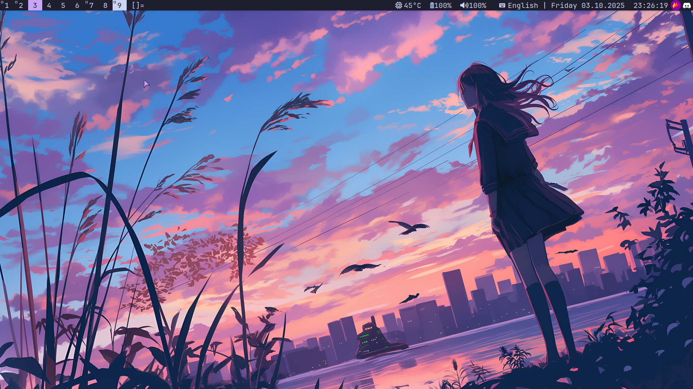

# Dependencies
### Screenshots
As you may notice (or maybe not lol), I use my own script for screenshots, where I call whatever I need.  
This line is located in the **key bindings** section and looks like this:
```c
    /* Screenshots */
    { 0, XK_Print, spawn, SHCMD("~/configurations/scripts/make-screenshot.sh") }
```
You can do the same — just replace the script path with your own.

### Fonts
- JetBrains Mono Nerd Font

### Build Tools
- make
- libx11-dev
- libxft-dev
- libxinerama-dev
- libxext-dev
    
### Audio (if you will use if)
- pulseaudio

### Brightness control
- brightnessctl
    
# Installation
```
sudo make clean install
```
# Run

```
exec dwm
```
# Configuring

Actual config is:  
```config.h```

# Create Desktop Entry

Entry path: 
```
/usr/share/xsessions/dwm.desktop
```
Entry content:
```
[Desktop Entry]
Encoding=UTF-8
Name=dwm
Comment=Dynamic window manager
Exec=dwm
Icon=dwm
Type=XSession
```

